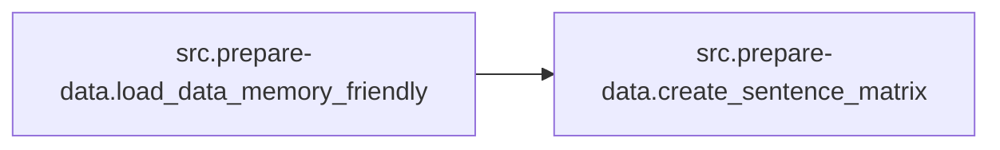

# Src Prepare-data

[_Documentation generated by Documatic_](https://www.documatic.com)

<!---Documatic-section-Codebase Structure-start--->
## Codebase Structure

<!---Documatic-block-system_architecture-start--->
```mermaid
None
```
<!---Documatic-block-system_architecture-end--->

# #
<!---Documatic-section-Codebase Structure-end--->

<!---Documatic-section-src.prepare_data.load_data_memory_friendly-start--->
## [src.prepare-data.load_data_memory_friendly](5-src_prepare-data.md#src.prepare-data.load_data_memory_friendly)

<!---Documatic-section-load_data_memory_friendly-start--->


### Object Calls

* [src.prepare-data.create_sentence_matrix](5-src_prepare-data.md#src.prepare-data.create_sentence_matrix)

<!---Documatic-block-src.prepare_data.load_data_memory_friendly-start--->
<details>
	<summary><code>src.prepare_data.load_data_memory_friendly</code> code snippet</summary>

```python
def load_data_memory_friendly(path, max_size, min_occurrences=10, valid_proportion=0.01):
    token_counter = Counter()
    size_counter = Counter()
    print('Creating vocabulary...')
    with open(path, 'rb') as f:
        for line in f:
            line = line.decode('utf-8')
            tokens = line.split()
            sent_size = len(tokens)
            if sent_size > max_size:
                continue
            top_bin = int(math.ceil(sent_size / 10) * 10)
            size_counter[top_bin] += 1
            token_counter.update(tokens)
    vocabulary = [w for (w, count) in token_counter.most_common() if count >= min_occurrences]
    vocabulary.insert(0, '</s>')
    vocabulary.insert(1, '<unk>')
    mapping = zip(vocabulary, range(len(vocabulary)))
    dd = defaultdict(lambda : 1, mapping)
    print('Converting word to indices...')
    train_data = {}
    valid_data = {}
    for threshold in size_counter:
        min_threshold = threshold - 9
        num_sentences = size_counter[threshold]
        print('Converting %d sentences with length between %d and %d' % (num_sentences, min_threshold, threshold))
        (sents, sizes) = create_sentence_matrix(path, num_sentences, min_threshold, threshold, dd)
        state = np.random.get_state()
        np.random.shuffle(sents)
        np.random.set_state(state)
        np.random.shuffle(sizes)
        ind = int(len(sents) * valid_proportion)
        valid_sentences = sents[:ind]
        valid_sizes = sizes[:ind]
        train_sentences = sents[ind:]
        train_sizes = sizes[ind:]
        train_data['sentences-%d' % threshold] = train_sentences
        train_data['sizes-%d' % threshold] = train_sizes
        valid_data['sentences-%d' % threshold] = valid_sentences
        valid_data['sizes-%d' % threshold] = valid_sizes
    print('Numeric representation ready')
    return (train_data, valid_data, vocabulary)
```
</details>
<!---Documatic-block-src.prepare_data.load_data_memory_friendly-end--->
<!---Documatic-section-load_data_memory_friendly-end--->

# #
<!---Documatic-section-src.prepare_data.load_data_memory_friendly-end--->

<!---Documatic-section-src.prepare_data.create_sentence_matrix-start--->
## [src.prepare-data.create_sentence_matrix](5-src_prepare-data.md#src.prepare-data.create_sentence_matrix)

<!---Documatic-section-create_sentence_matrix-start--->
<!---Documatic-block-src.prepare_data.create_sentence_matrix-start--->
<details>
	<summary><code>src.prepare_data.create_sentence_matrix</code> code snippet</summary>

```python
def create_sentence_matrix(path, num_sentences, min_size, max_size, word_dict):
    sentence_matrix = np.full((num_sentences, max_size), 0, np.int32)
    sizes = np.empty(num_sentences, np.int32)
    i = 0
    with open(path, 'rb') as f:
        for line in f:
            line = line.decode('utf-8')
            tokens = line.split()
            sent_size = len(tokens)
            if sent_size < min_size or sent_size > max_size:
                continue
            array = np.array([word_dict[token] for token in tokens])
            sentence_matrix[i, :sent_size] = array
            sizes[i] = sent_size
            i += 1
    return (sentence_matrix, sizes)
```
</details>
<!---Documatic-block-src.prepare_data.create_sentence_matrix-end--->
<!---Documatic-section-create_sentence_matrix-end--->

# #
<!---Documatic-section-src.prepare_data.create_sentence_matrix-end--->

<!---Documatic-section-src.prepare_data.load_data-start--->
## [src.prepare-data.load_data](5-src_prepare-data.md#src.prepare-data.load_data)

<!---Documatic-section-load_data-start--->
<!---Documatic-block-src.prepare_data.load_data-start--->
<details>
	<summary><code>src.prepare_data.load_data</code> code snippet</summary>

```python
def load_data(path, max_size, min_occurrences=10):
    sentences = []
    sizes = []
    longest_sent_size = 0
    index = [0]

    def on_new_word():
        index[0] += 1
        return index[0]
    word_dict = defaultdict(on_new_word)
    with open(path, 'rb') as f:
        for line in f:
            line = line.decode('utf-8')
            tokens = line.split()
            sent_size = len(tokens)
            if sent_size > max_size:
                continue
            sentences.append([word_dict[token] for token in tokens])
            sizes.append(sent_size)
            if sent_size > longest_sent_size:
                longest_sent_size = sent_size
    reverse_word_dict = {v: k for (k, v) in word_dict.items()}
    reverse_word_dict[0] = '</s>'
    sentence_matrix = np.full((len(sentences), longest_sent_size), 0, np.int32)
    for (i, sent) in enumerate(sentences):
        sentence_array = np.array(sent)
        sentence_matrix[i, :sizes[i]] = sentence_array
    counter = Counter(sentence_matrix.flat)
    counter[0] = len(sentence_matrix)
    unk_words = [(w, counter[w]) for w in counter if counter[w] < min_occurrences]
    unk_count = sum((item[1] for item in unk_words))
    unk_index = len(counter)
    counter[unk_index] = unk_count
    reverse_word_dict[unk_index] = '<unk>'
    replacements = {}
    word_list = []
    for (new_index, (old_index, count)) in enumerate(counter.most_common()):
        if count < min_occurrences:
            break
        replacements[old_index] = new_index
        word_list.append(reverse_word_dict[old_index])
    new_unk_index = replacements[unk_index]
    replacements_with_unk = defaultdict(lambda : new_unk_index, replacements)
    original_shape = sentence_matrix.shape
    replaced = np.array([replacements_with_unk[w] for w in sentence_matrix.flat], dtype=np.int32)
    sentence_matrix = replaced.reshape(original_shape)
    sizes_array = np.array(sizes, dtype=np.int32)
    return (sentence_matrix, sizes_array, word_list)
```
</details>
<!---Documatic-block-src.prepare_data.load_data-end--->
<!---Documatic-section-load_data-end--->

# #
<!---Documatic-section-src.prepare_data.load_data-end--->

<!---Documatic-section-src.prepare_data.write_vocabulary-start--->
## [src.prepare-data.write_vocabulary](5-src_prepare-data.md#src.prepare-data.write_vocabulary)

<!---Documatic-section-write_vocabulary-start--->
<!---Documatic-block-src.prepare_data.write_vocabulary-start--->
<details>
	<summary><code>src.prepare_data.write_vocabulary</code> code snippet</summary>

```python
def write_vocabulary(words, path):
    text = '\n'.join(words)
    with open(path, 'wb') as f:
        f.write(text.encode('utf-8'))
```
</details>
<!---Documatic-block-src.prepare_data.write_vocabulary-end--->
<!---Documatic-section-write_vocabulary-end--->

# #
<!---Documatic-section-src.prepare_data.write_vocabulary-end--->

[_Documentation generated by Documatic_](https://www.documatic.com)